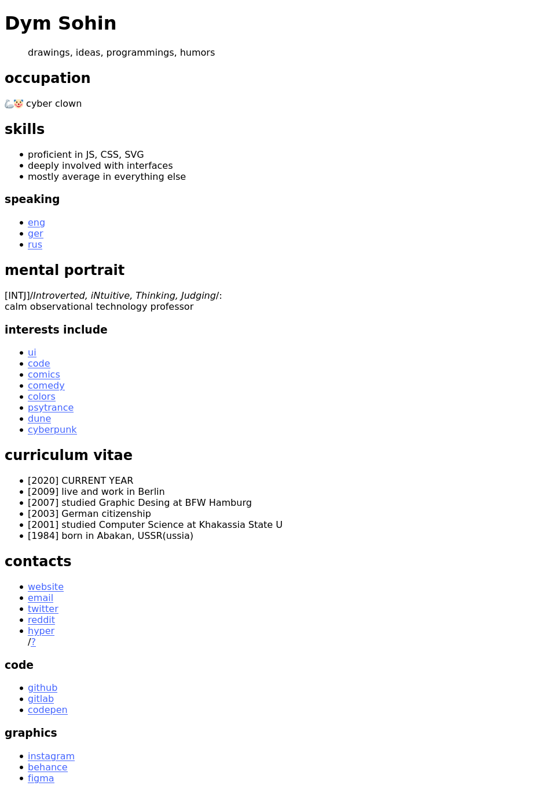

# website-progress

> steps to create a website

## [01 markdown](01-markdown)

- [preview](01-markdown/preview.html)
- https://codepen.io/dym-sh/pen/RwRQeYj/left/?editors=1000

## [02 colors](02-colors)

- [preview](02-colors/preview.html)
- https://codepen.io/dym-sh/pen/dyXWLGZ/left/?editors=0100

## mirrors
- https://github.com/dym-sh/website-progress
- https://gitlab.com/dym-sh/website-progress
- https://dym.sh/lab/website-progress
- hyper://6cff1f9372da66602ca344a9b41dc6de8266301e65e2dec59e65754fa67266c7 /[?](https://beakerbrowser.com)

## license
[mit](license)
