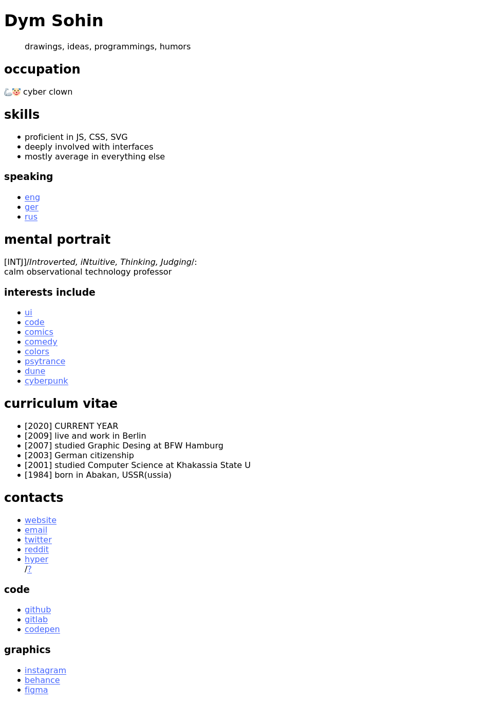
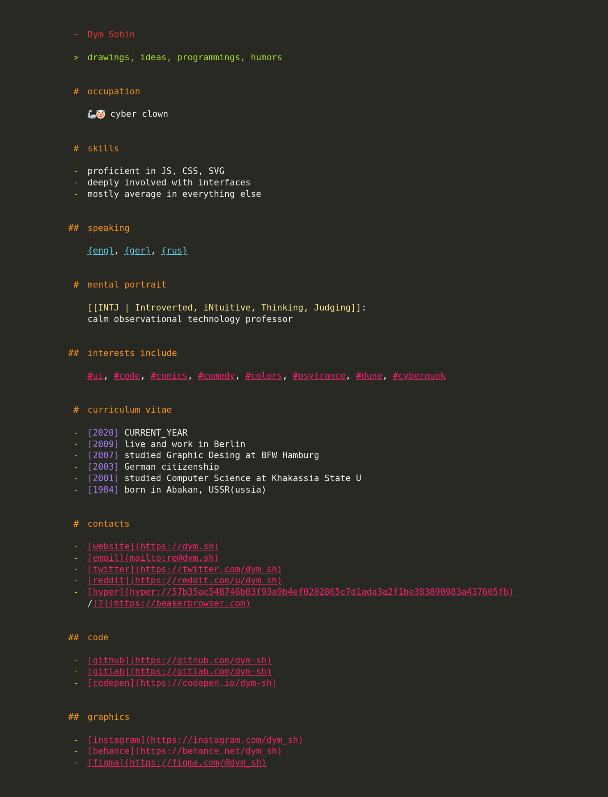
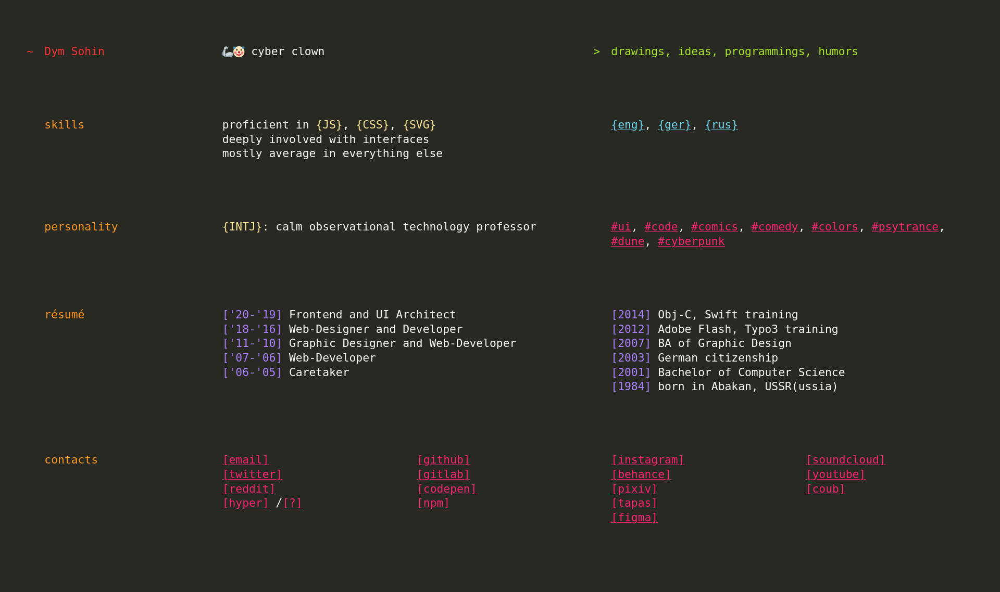

# website-progress

> steps to create a website

### [01 text](01-text)
- [preview](01-text/preview.html)
- https://codepen.io/dym-sh/pen/RwRQeYj/left/?editors=1000

### [02 colors](02-colors)
- [preview](02-colors/preview.html)
- https://codepen.io/dym-sh/pen/dyXWLGZ/left/?editors=0100

### [03 layout](03-layout)
- [preview](03-layout/preview.html)
- https://codepen.io/dym-sh/pen/<TBD>/left/?editors=0100

### [04 typography](04-typography)
- [preview](04-typography/preview.html)
- https://codepen.io/dym-sh/pen/<TBD>/left/?editors=0100

### [05 TBD](05-TBD)
- [preview](05-TBD/preview.html)
- https://codepen.io/dym-sh/pen/<TBD>/left/?editors=0100

## todo
- content managment system (tags, languages, categories, sets, etc)
- search, access-scopes, and pagination
- syndication (rss, json-feed, activitypub)
- aggregation and cross-posting (twitter, reddit, instagram, etc)
- content managment system (tags, languages, categories, sets, etc)
- search, access-scopes, and pagination

### main content types
- notes (micro-blog, articles)
- gallery (drawings, photos)
- lab (code-hosting, snippets, playground)

## mirrors
- https://github.com/dym-sh/website-progress
- https://gitlab.com/dym-sh/website-progress
- https://dym.sh/lab/website-progress
- hyper://6cff1f9372da66602ca344a9b41dc6de8266301e65e2dec59e65754fa67266c7 /[?](https://beakerbrowser.com)

## license
[mit](license)
